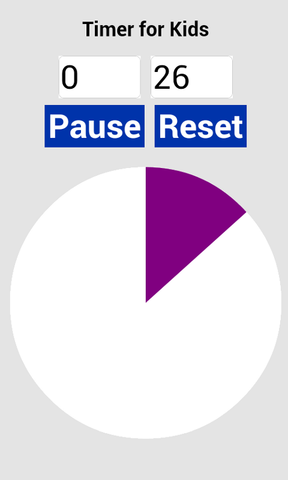

Timer for Kids - Android (Phonegap) app
==============

This is a simple countdown timer for kids with minutes and seconds.

For kids who understand time, it shows the minutes and seconds counting down.

For kids who don't yet understand time, it shows a circular "clock" that fills up in proportion to the time left on the counter.

Users can adjust the time, the clock color, and turn the ticking sound on or off.

[Available for FREE download on Amazon.com](http://www.amazon.com/Shaun-Gallagher-Timer-for-Kids/dp/B00IOW6SU2/)

